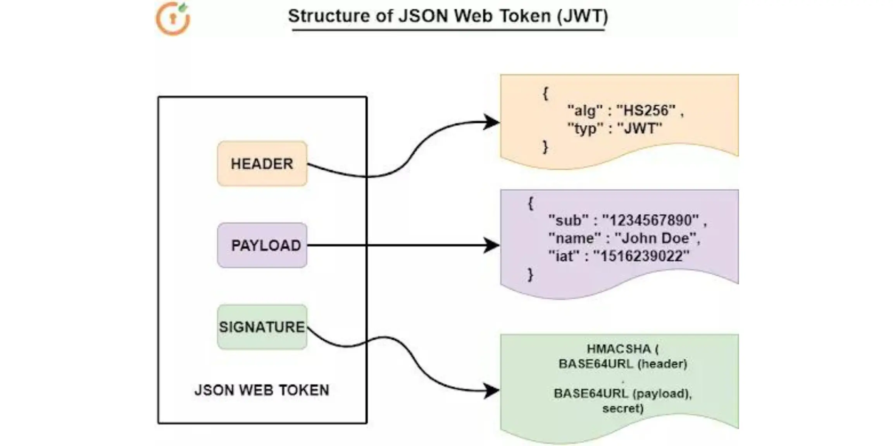
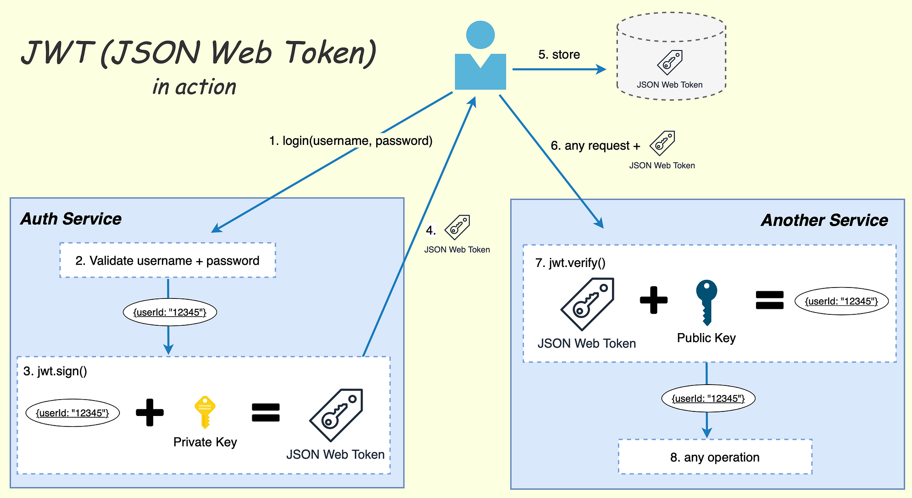
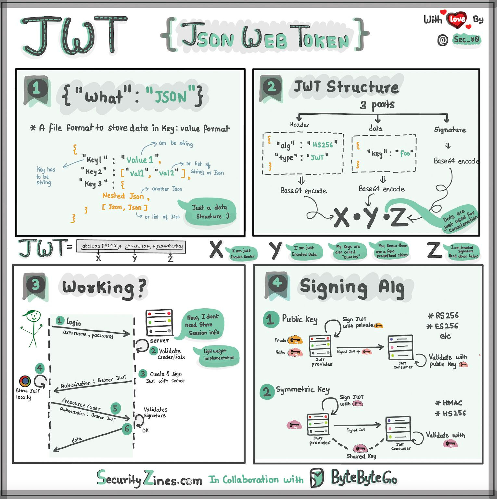

## JWT
Self validating tokens

#### What is JWT Token ?
JSON Web Token (JWT) is an open standard (RFC 7519) that defines 
a _**compact and self-contained way for securely transmitting information between parties as a JSON object**_. 

This information can be verified and trusted because it is digitally signed. ,
JWTs can be signed using a secret (with the HMAC algorithm) or a public/private key pair using RSA or ECDSA.

Let's consider below scenario:
1. A user tries to login to an auth service
    -> **verifies data like =email+ password combination** then **generate token**
2. When the authorization is granted, the authorization server returns an access token to the application
3. The application uses the access token to access a protected resource (like an API)

This token is made of 3 parts
#### Header : 
        `{
  "alg": "HS256" // type of the token,
  "typ": "JWT // -signing algorithm being used"
}`

=> JSON is Base64Url encoded to form the first part of the JWT
**this JSON is Base64Url encoded to form the first part of the JWT**

#### Payload :
`{
"sub": "1234567890",
"name": "John Doe",
"admin": true
}`
**The payload is then Base64Url encoded to form the second part of the JSON Web Token**

   Do note that for signed tokens this information, though protected against tampering, is readable by anyone. 
   > Do not put secret information in the payload or header elements of a JWT unless it is encrypted.

The second part of the token is the payload, which contains the claims. 
Claims are statements about an entity (typically, the user) and additional data. 
There are three types of claims: 
1. registered
2. public
3. private claims

**_Registered claims_** :
These are a set of predefined claims which are not mandatory but recommended, to provide a set of useful, interoperable claims. 
Some of them are: 
1. iss (issuer), 
2. exp (expiration time), 
3. sub (subject),
4. aud (audience), and 
5. others

**_Public claims_** : 
These can be defined at will by those using JWTs. 
But to avoid collisions they should be defined in the 
IANA JSON Web Token Registry or be defined as a URI that contains a collision resistant namespace.

_**Private Claims**_ :
These are the custom claims created to share information between parties 
that agree on using them and are neither registered or public claims.
   

`name: "ABC",email: "abc@we.com", expiry_time: "123", sessionToken: "aksjh328sdvii98"`
   

#### Signature: 
To create the signature part you have to take the encoded header, the encoded payload, a secret, the algorithm specified in the header, and sign that.
= `HMACSHA256(
base64UrlEncode(header) + "." +
base64UrlEncode(payload),
secret)`
The signature is used to verify the message wasn't changed along the way, 
and, in the case of tokens signed with a private key, 
it can also verify that the sender of the JWT is who it says it is.

