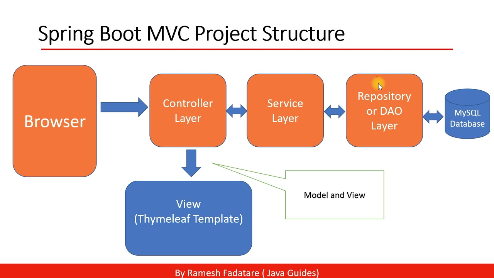
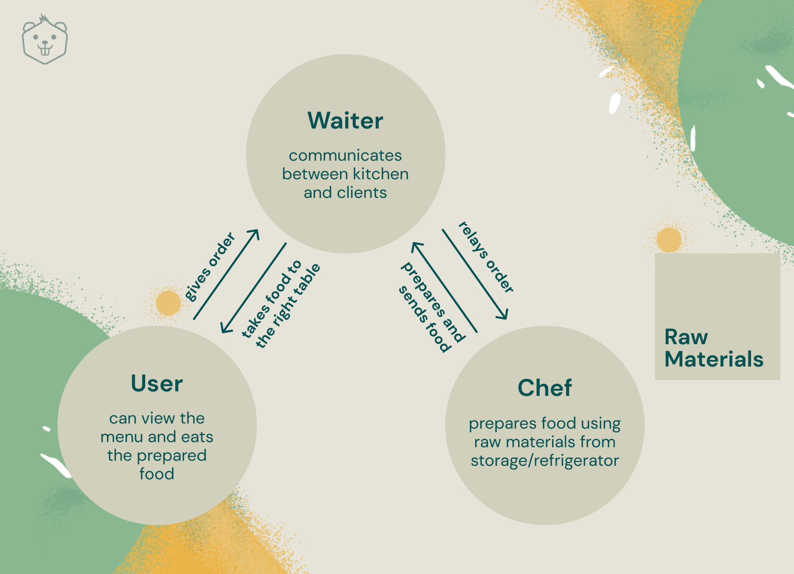
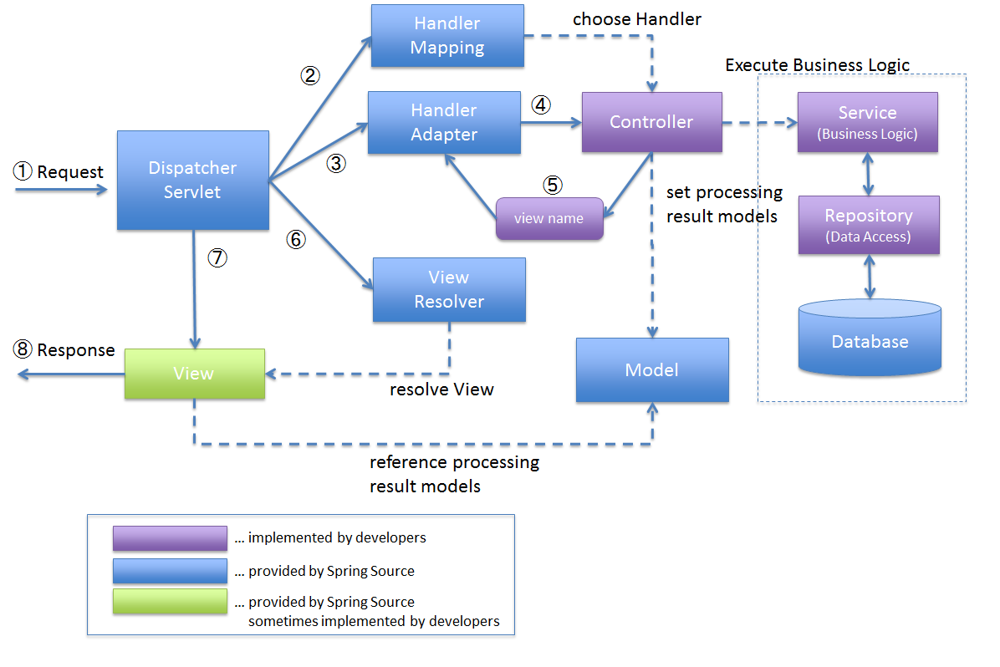

## MVC Pattern

What is the most common way structuring web application : Model View Controller

### Restaurant analogy
Consider a restaurant where a user orders to a waiter and waiter tells the chef .

Let’s take the example of a restaurant.
When you visit a restaurant, the waiter presents you with a menu. You view the menu and then tell the waiter your order. 
The waiter notes down the order and passes it to the chef, in the kitchen. 
The chef uses the raw materials from the refrigerator and cooks the dish. 
The waiter then takes the dish from the kitchen and then presents it to you, after which you can enjoy your meal.

### Overview of Spring MVC Architecture

DispatcherServlet is core of

1. DispatcherServlet receives the request.
2. DispatcherServlet dispatches the task of selecting an appropriate controller to HandlerMapping. HandlerMapping selects the controller which is mapped to the incoming request URL and returns the (selected Handler) and Controller to DispatcherServlet.
3. DispatcherServlet dispatches the task of executing of business logic of Controller to HandlerAdapter.
4. HandlerAdapter calls the business logic process of Controller.
5. Controller executes the business logic, sets the processing result in Model and returns the logical name of view to HandlerAdapter.
6. DispatcherServlet dispatches the task of resolving the View corresponding to the View name to ViewResolver. ViewResolver returns the View mapped to View name.
7. DispatcherServlet dispatches the rendering process to returned View.
8. View renders Model data and returns the response.

