## Spring Framework

3 important features : 
1. Dependency Injection
2. Config Management
3. Class Management

>> We need not create object of classes, Spring is going to create for us -> using dependency injection
> Ensure that objects created are in mentioned order as well as dependencies are also injected on your behalf
All above are part of Spring core

> Spring follows lots of plug and play
We just need to configure it using configure file
> 

#### Spring Boot:

> Provides an opinionated view on setting up Spring project
> Spring boot made it easy for us to get started to use Spring projects
> Automatically kickstart projects with sensitive defaults
> Spring makes it easy for override it

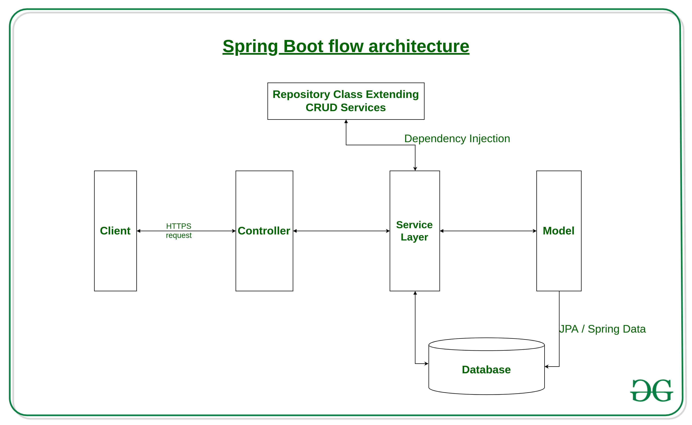

Let's see some architecture diagrams from some famous websites
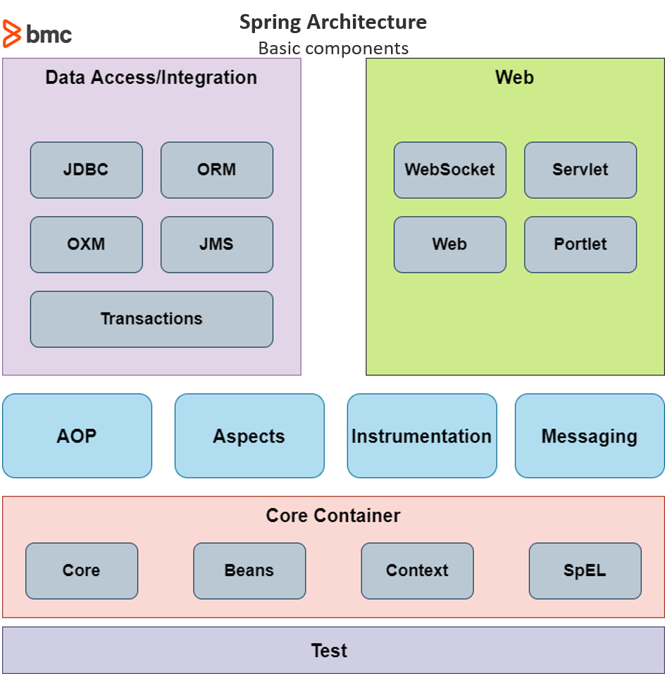

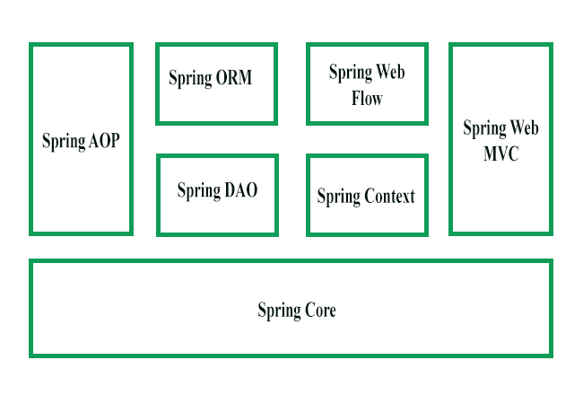

##### Why inversion control ?
Instead of us passing dependencies, framework(Spring) is managing for us.

##### Config management :

We can configure profiles using `application.properties` and `application-prod.properties`

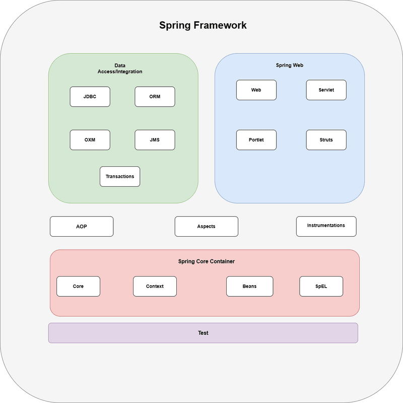

### Suite of Spring Projects:
Spring has lots of projects which can be integrated with our application seamlessly

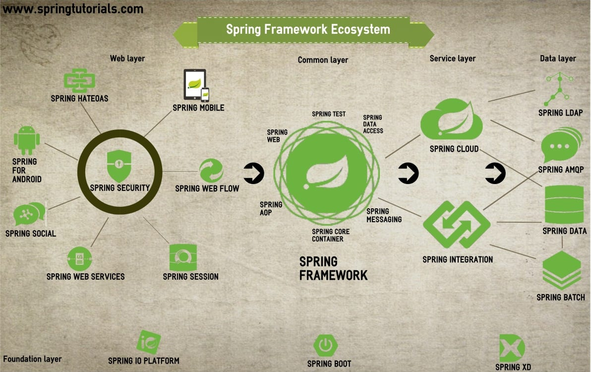

## Spring IoC Container and Beans

Dependency injection (DI) is a specialized form of IoC, whereby objects define their dependencies (that is, the other objects they work with) only through:
1. constructor arguments, 
2. arguments to a factory method, or 
3. properties that are set on the object instance after it is constructed or returned from a factory method. 

The IoC container then injects those dependencies when it creates the bean. 
This process is fundamentally the inverse (hence the name, Inversion of Control) of the bean itself controlling the instantiation 
or location of its dependencies by using direct construction of classes or a mechanism such as the Service Locator pattern

##### Beans and contexts
The `org.springframework.beans` and `org.springframework.context` packages are the basis for Spring Framework’s IoC container. 

The **BeanFactory interface provides an advanced configuration mechanism capable of managing any type of object**. 
ApplicationContext is a sub-interface of BeanFactory. It adds:
1. Easier integration with Spring’s AOP features
2. Message resource handling (for use in internationalization)
3. Event publication
4. Application-layer specific contexts such as the WebApplicationContext for use in web applications

In nutshell, the **BeanFactory provides the configuration framework and basic functionality**, 
and the **ApplicationContext adds more enterprise-specific functionality**.

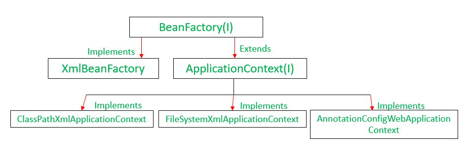

In Spring, the objects that form the backbone of our application and that are managed by the Spring IoC container are called beans. 

**A bean is an object that is instantiated, assembled, and managed by a Spring IoC container**. 
Otherwise, a bean is simply one of many objects in your application. 
> Beans, and the dependencies among them, are reflected in the configuration metadata used by a container.

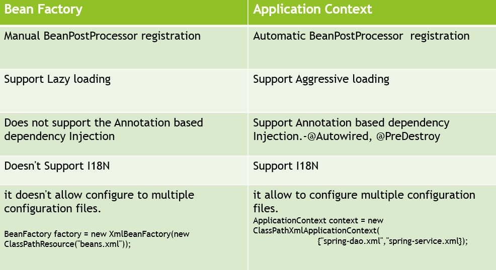

## Container Overview :

The `org.springframework.context.ApplicationContext` interface represents the **Spring IoC container and is responsible for instantiating, configuring, and assembling the beans**. 

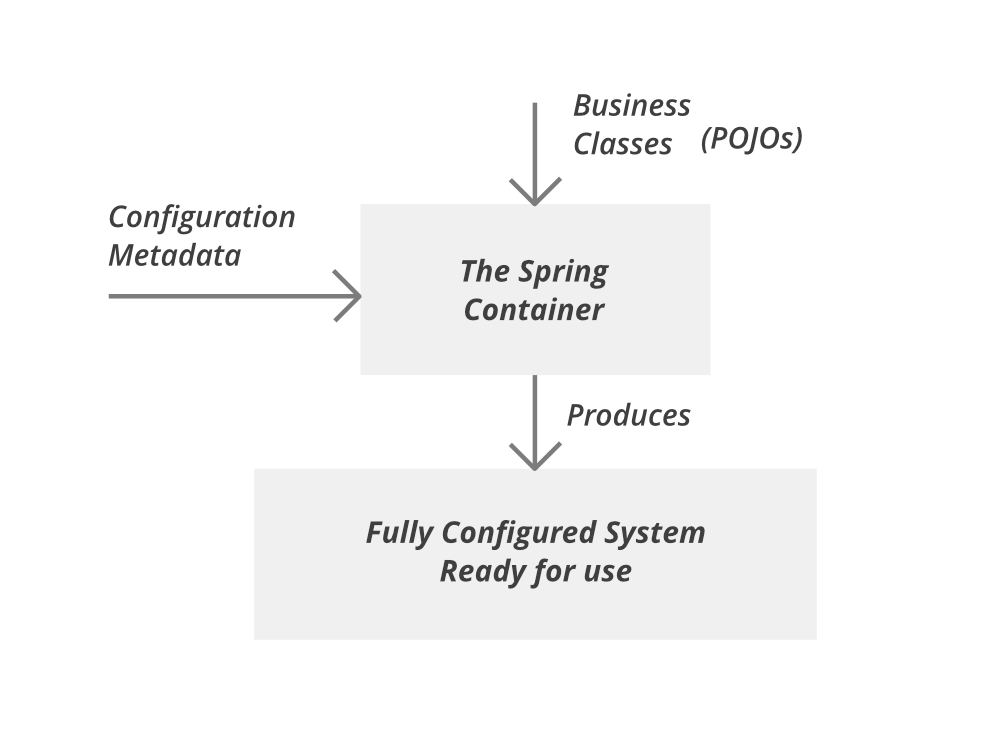

The container gets its instructions on the components to instantiate, configure, and assemble by reading configuration metadata. 
The configuration metadata can be represented as:
1. annotated component classes, 
2. configuration classes with factory methods, or 
3. external XML files or 
4. Groovy scripts.
With either format, we may compose our application and the rich interdependencies between those components.

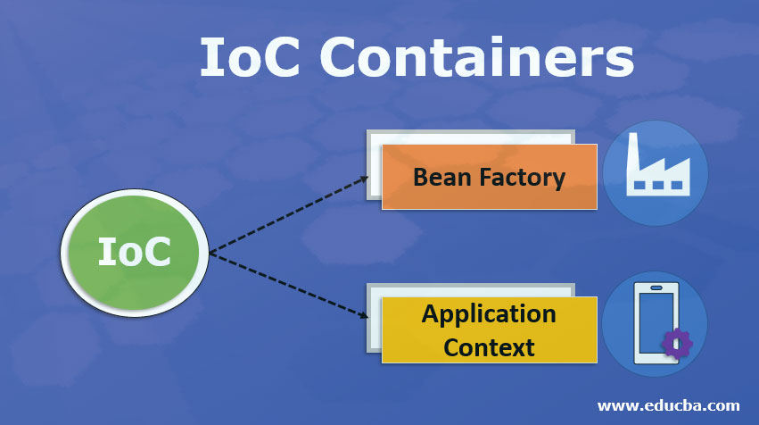

Several implementations of the ApplicationContext interface are part of core Spring. 
In stand-alone applications, it is common to create an instance of AnnotationConfigApplicationContext or ClassPathXmlApplicationContext

In most application scenarios, explicit user code is not required to instantiate one or more instances of a Spring IoC container. 
For example, in a plain web application scenario, a simple boilerplate web descriptor XML in the web.xml file of the application suffices (see Convenient ApplicationContext Instantiation for Web Applications). 

In a _Spring Boot scenario_, the application context is implicitly bootstrapped for us based on common setup conventions

## Bean Overview
A Spring IoC container manages one or more beans. 
These beans are created with the configuration metadata that you supply to the container (for example, in the form of XML <bean/> definitions).

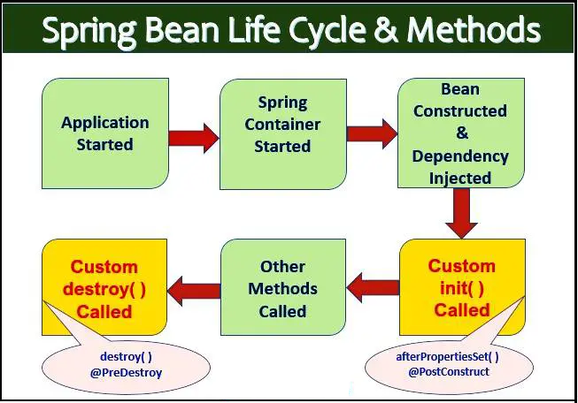
Bean Life cycle

Within the container itself, these bean definitions are represented as BeanDefinition objects, 
which contain (among other information) the following metadata:
1. **A package-qualified class name**: typically, the actual implementation class of the bean being defined.
2. **Bean behavioral configuration elements**, which state how the bean should behave in the container (scope, lifecycle callbacks, and so forth).
3. **References to other beans that are needed for the bean to do its work**. These references are also called collaborators or dependencies.
4. **Other configuration settings to set in the newly created object**, for example, the size limit of the pool or the number of connections to use in a bean that manages a connection pool.
.
   This metadata translates to a set of properties that make up each bean definition. 

In addition to bean definitions that contain information on how to create a specific bean, 
the ApplicationContext implementations also permit the registration of existing objects that are created outside the container (by users).

This is done by accessing the ApplicationContext’s BeanFactory through the getBeanFactory() method, which returns the DefaultListableBeanFactory implementation. 

DefaultListableBeanFactory supports this registration through the 
> registerSingleton(..) and 
> registerBeanDefinition(..) methods. 

However, typical applications work solely with beans defined through regular bean definition metadata..

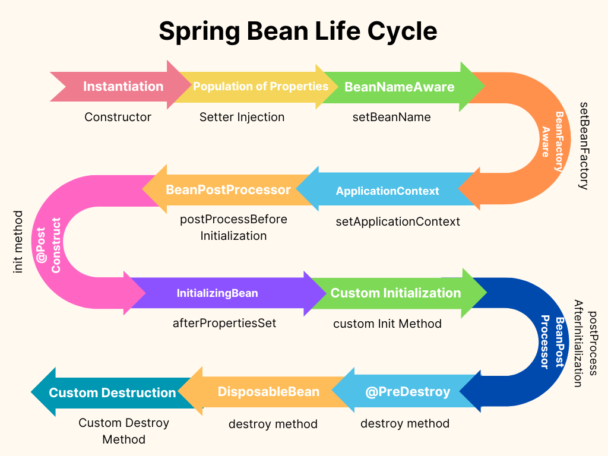

### Overriding Beans:

Bean overriding is happening when a bean is registered using an identifier that is already allocated. 
While bean overriding is possible, it makes the configuration harder to read and **this feature will be deprecated in a future release.**

To disable bean overriding altogether, you can set the `allowBeanDefinitionOverriding` flag to `false` on the ApplicationContext before it is refreshed. 
In such setup, an exception is thrown if bean overriding is used.

### Naming Beans:
Every bean has one or more identifiers. 

These identifiers must be unique within the container that hosts the bean. 
A bean usually has only one identifier. However, if it requires more than one, the extra ones can be considered aliases.

We are not required to supply a name or an id for a bean. 
If we do not supply a name or id explicitly, the container generates a unique name for that bean. 
However, if we want to refer to that bean by name, through the use of the ref element or a Service Locator style lookup, we must provide a name. 
Motivations for not supplying a name are related to using inner beans and autowiring collaborators.

#### Aliasing a Bean outside the Bean Definition
